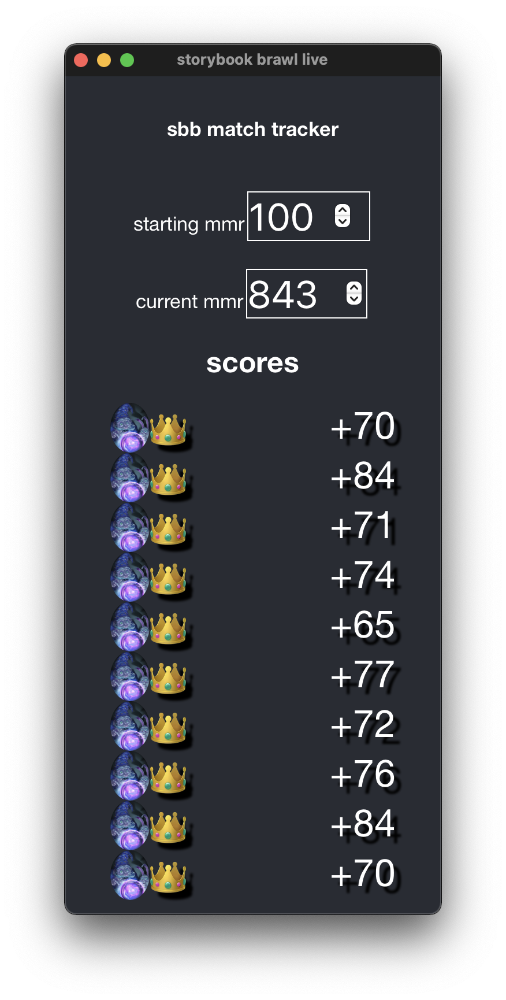

# storybook brawl live

A window that shows your recent match results in storybook brawl

## development

    git clone --recursive --shallow-submodules https://github.com/jedahan/sbb-live
    cd sbb-live
    npm install
    npm start

## credits

Thanks to @raschy of https://github.com/SBBTracker/SBBTracker for doing most of the original work parsing log files, and general advice
