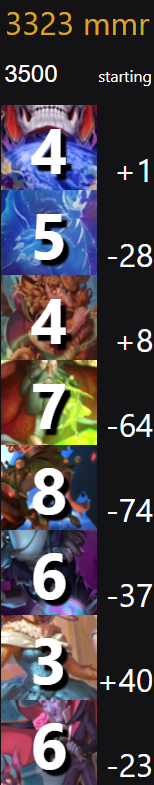

# todo

* build: output windows binary that serves the site locally (`esbuild --servedir`)
* logs: look for StoryBook Brawl logs folder, ask if not found
* streams: test on my stream for a couple of days, then share with others

